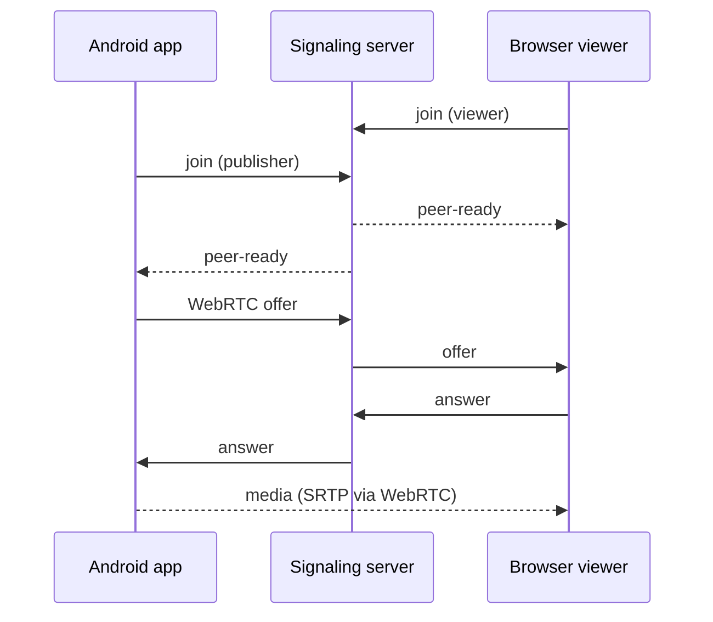

# Android screen share POC (video + audio → browser)

Proof of concept that captures the **Android screen** and **device playback audio** (media/game sounds, not microphone) and streams them to a **web browser** using **WebRTC**. A small **WebSocket signaling server** exchanges SDP/ICE between the phone and the browser.

## Architecture



- **Video**: `MediaProjection` + WebRTC `ScreenCapturerAndroid`
- **Audio (API 29+)**: `AudioPlaybackCaptureConfiguration` tied to the same `MediaProjection`
- **Transport**: WebRTC peer connection (STUN: Google public)
- **Signaling**: Node.js `ws` server in `signaling-server/`

## Requirements

- Android **8.1+** (API 27) for the app; **system audio capture needs API 29+**
- Node.js 18+ for signaling
- Phone and PC on the **same Wi‑Fi** (or USB debugging with port forward)
- A desktop browser with WebRTC (Chrome, Edge, Firefox)

## Quick start

### 1. Start signaling server (on your computer)

The phone and browser connect **to your Mac/PC** over the LAN. The Node process must be running **and** allowed to accept **incoming** TCP connections on port **8080** (WebSocket signaling).

```bash
cd signaling-server
npm install
npm start
```

You should see: `Signaling server listening on ws://0.0.0.0:8080`.

Find your Mac’s LAN IP (Wi‑Fi example):

```bash
ipconfig getifaddr en0
```

Use that in the app and browser, e.g. `ws://192.168.1.42:8080` — not `localhost`, when using a physical phone.

#### Allow incoming connections on macOS

macOS **Firewall** can block the Node server so the phone never reaches port 8080.

1. **System Settings** → **Network** → **Firewall** (or **Privacy & Security** → **Firewall** on older macOS).
2. Turn **Firewall** on if you use it; click **Options…** (or **Firewall Options**).
3. Ensure **Node** is allowed to receive incoming connections:
   - If you see **Node**, **node**, or **Terminal** in the list, set it to **Allow incoming connections**.
   - If nothing appears yet, start the server (`npm start`) and connect once from the phone or browser — macOS may show a prompt; choose **Allow**.
4. To add manually: **Options** → **+** → add `/usr/local/bin/node` or the path from `which node`, then allow incoming.
5. **Same Wi‑Fi**: Phone and Mac must be on the same network (guest Wi‑Fi often blocks device-to-device traffic).

**Check that the port is listening** (server running):

```bash
lsof -iTCP:8080 -sTCP:LISTEN
```

**Check from the phone’s perspective** (replace with your Mac IP):

```bash
curl -v http://192.168.1.42:8080/
```

You should get `POC screen-share signaling server`. If this fails from another machine on the LAN, the firewall or network is still blocking port 8080.

**USB debugging only** (no LAN): forward the port instead of opening the firewall:

```bash
adb reverse tcp:8080 tcp:8080
```

Then use `ws://127.0.0.1:8080` on the phone and `ws://127.0.0.1:8080` in the browser on the Mac.

### 2. Open the web viewer

Serve `web/index.html` (any static server), or open the file directly for a quick test:

```bash
cd web
npx --yes serve -p 3000
```

Open `http://localhost:3000`, set **WebSocket URL** to your PC’s LAN IP, e.g. `ws://192.168.1.42:8080`, room `poc`, click **Connect**.

### 3. Run the Android app

- Build/run from Android Studio on a **physical device** (emulator can work for video; use `ws://10.0.2.2:8080` to reach the host machine from the emulator).
- Set the same signaling URL (LAN IP) and room ID.
- Tap **Start screen + audio share**, approve screen capture and notifications.
- Play audio on the phone (YouTube, music, etc.); the browser `<video>` element plays both video and audio.

### 4. Order matters

1. Browser viewer **Connect** first  
2. Then Android **Start share**  
3. When both are in the room, the app sends an offer and the browser answers  

## Project layout

| Path | Role |
|------|------|
| `app/…/webrtc/ScreenSharePublisher.kt` | WebRTC peer, screen capturer, tracks |
| `app/…/webrtc/PlaybackCaptureAudioDeviceModule.kt` | System audio via playback capture |
| `app/…/signaling/SignalingClient.kt` | WebSocket signaling |
| `signaling-server/server.js` | Room-based SDP/ICE relay |
| `web/index.html` | Browser viewer |

## Limitations (POC)

- **No TURN server** — may fail across strict NATs; fine on LAN.
- **No encryption** on signaling (plain WebSocket); use only on trusted networks.
- Some apps block playback capture (DRM, protected content).
- OEM-specific restrictions on internal audio capture may apply.
- Foreground service + media projection required while sharing.

## Samsung / playback capture diagnostic

From the main screen (while not sharing), open **Samsung playback capture test**. This runs `PlaybackAudioCapture` only (no WebRTC) and shows a live **Peak** value:

- **Peak > 0** — OS is delivering PCM; screen-share-while-muted can work on this device/strategy.
- **Peak = 0** — REMOTE_SUBMIX is silent; try **Next capture strategy** (USAGE_MEDIA → USAGE_MEDIA+UIDs → ALL_USAGES) or **Play in-app test tone**, then compare with YouTube.

## Troubleshooting

| Issue | Check |
|-------|--------|
| No video in browser | Viewer connected before publisher? Same room ID? |
| No audio | API 29+? Audio actually playing on device? Unmute browser video. |
| Can’t connect signaling | Node server running? macOS firewall allows **incoming** on port 8080? Correct LAN IP (not `localhost` on phone)? `usesCleartextTraffic` for `ws://` |
| Emulator → host | Use `ws://10.0.2.2:8080` |
| USB → host, no LAN | `adb reverse tcp:8080 tcp:8080` then `ws://127.0.0.1:8080` on the phone |

## License

POC / sample code for evaluation.
